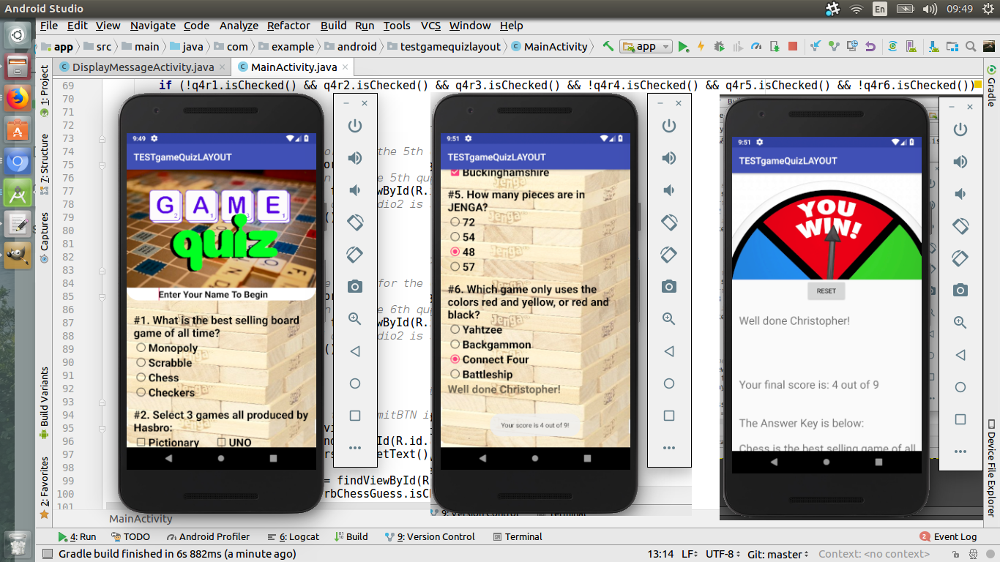

# GameQuiz
This is my submission for the final project on Udacity's Android Developers Beginner Program.
The specifications of this project were:
 - App contains 4-10 questions, including at least one check box, one radio button, and one text entry.
 - Questions are in a variety of formats such as free text response, check boxes, and radio buttons.
 - Include a button for the user to submit their answers and receive a score

